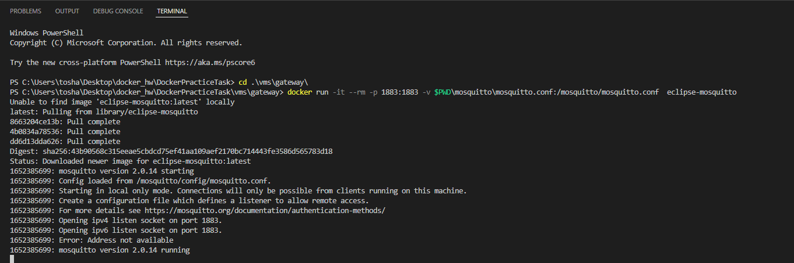

# Выполнение

Скрипт для генерации данных симулятора датчика и отправки на mqtt брокер - main.py


Подключусь к трем виртуальным машинам через ssh и установлю на каждую докер:

```
sudo apt-get install docker
```


Зайдем в docker_compose.yml на клиенте, в котором содержится конфигурация трех докер контейнеров для трех датчиков. Зададим названия образов, типов датчиков и ip хоста


Cкачаем и запустим контейнер mosquitto broker

```
docker run -it --rm -p 1883:1883 -v $PWD\mosquitto\mosquitto.conf:/mosquitto/mosquitto.conf  eclipse-mosquitto
```



На сервере в файле telegraf.conf настроим нужный ip 


Также на сервере в infuxdb-init.iql добавим 
```
USE SENSORS
```


Копируем папки client, server и gateway на соответствующие виртуальные машины
```
scp -P 1001 -r .\vms\server\infra shibalov_1@localhost:/home/shibalov_1/infra
scp -P 1002 -r .\vms\gateway\mosquitto shibalov_2@localhost:/home/shibalov_2/mosquitto
scp -P 1003 -r .\vms\client\mqtt_sensor_simulate shibalov_3@localhost:/home/shibalov_3/mqtt_sensor_simulate
```


На шлюзе создадим правила для порта 1883

```
sudo iptables -A OUTPUT -o enp0s8 -p tcp --syn --dport 1883 -m conntrack --ctstate NEW,ESTABLISHED,RELATED -j ACCEPT
sudo iptables -A OUTPUT -o enp0s9 -p tcp --syn --dport 1883 -m conntrack --ctstate NEW,ESTABLISHED,RELATED -j ACCEPT
sudo iptables -A INPUT -i enp0s8 -p tcp --syn --dport 1883 -m conntrack --ctstate NEW,ESTABLISHED,RELATED -j ACCEPT
sudo iptables -A INPUT -i enp0s9 -p tcp --syn --dport 1883 -m conntrack --ctstate NEW,ESTABLISHED,RELATED -j ACCEPT
```
и сохраним

```
sudo iptables-save > /etc/iptables/rules.v4
sudo ip6tables-save > /etc/iptables/rules.v6
```

На сервере у меня почему-то не было соединения с интернетом, но 
```
sudo apt-get update
```
и 
```
sudo apt-get upgrade
```
Все починили


Попробуем с сервера подключиться к mosquitto брокеру:


И видим, что приконнектился новый клиент на шлюзе 


На клиенте проставим IP адрес брокера со стороны клиента


Запустим main.py и посмотрим, доходит ли что-то до сервера


Видим, что приходят данные с датчиков, отлично

На клиенте в dockerfile пропишем следующее для создания образа контейнера
```
FROM python:3.7
WORKDIR /app
COPY requirements.txt .
RUN pip install -r requirements.txt
COPY . .
CMD ["python", "main.py"]
```

И соберем его 


Запустим контейнер


Видим коннект на шлюзе


И данные на сервере


Логинюсь на докерхабе и пушу образ


Запущу три контейнера с датчиками на клиенте


На шлюзе есть подключения и на сервер приходят данные


Откроем порт для графаны


Запустим docker compose с influxdb, grafana и telegraf на сервере


C браузера перейдем на localhost:3000, залогинюсь в grafana 


Создам три панели с графиками для тока, давления и температуры. Немного поиграюсь с кастомизацией графиков


Выведу все на один dashboard


И копирну настройки mqtt.json в файл, который буду заливать в гит

Все!

p.s.
Создавал образ контейнера и пушил я на виртуальной машине, потому что докер на винде вставать не хотел: просил выключить компонент Virtual Machine Platform, а когда я его выключал, то виртуальные машины без этого компонента не запускались. Ну и в обратном порядке так же. В общем, без виртуальных машин я никуда, а докер собрать и на виртуалке смогу, поэтому сделал так...